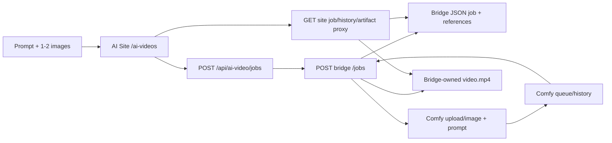

# Current AI Video path

**Status:** Operational internal path, with three historical completed bridge jobs observed through `GET :8788/jobs`; no generation was submitted by this audit. The bridge was live and reported ready/available, Comfy and Creative idle, lock free. This proves the current path exists and has completed work, not that arbitrary SaaS users can run it.

## Exact boundary

- Browser uses `app/src/app/ai-videos/page.tsx`. It posts `multipart/form-data` with prompt, duration, resolution, 9:16, one/two files, and a client UUID idempotency key; polls `/api/ai-video/jobs/:id`; lists `/api/ai-video/jobs`; previews/downloads `/api/ai-video/jobs/:id/artifact`. Readiness is `/api/ai-video/bridge/status` every 15 seconds. A same-origin check guards write routes. AI Site does not store the job; its `src/lib/integrations/h3-bridge/jobs.ts` converts files to base64 and proxies to bridge.
- Bridge `src/server.ts` accepts `POST /jobs`, `GET /jobs`, `GET /jobs/:id`, `POST /jobs/:id/submit` (only waiting-before-submit), `GET /jobs/:id/artifact`, `GET /health`. Job UUID is both bridge history identity and output namespace. Comfy prompt ID is recorded separately. No workspace ID.
- Bridge `src/jobs.ts` owns `data/jobs/<job-id>` and `data/generation.lock`. Repeated UUID with identical input reuses the job; changed payload conflicts. `src/engine.ts` writes intent/submission count before its one Comfy `/prompt`. Ambiguous response becomes `SUBMISSION_UNKNOWN` and is reconciled from queue/history, not resubmitted. Polling `GET /jobs/:id` can advance persisted state.
- Bridge validates graph hash/nodes, uploads reference images through Comfy `/upload/image` into `ai_site/<job-id>`, checks Creative/Comfy activity before submission, reads Comfy `/history/<prompt-id>`, then retrieves exact SaveVideo output through `/view`. It validates MP4 and copies to bridge `output/video.mp4`; AI Site streams this copy with byte-range support. It never reads Creative Studio's archive as job output.

## Current controls and states

Current `h3-bridge/src/contract.ts` and live `/health` agree: durations **4–15 seconds**; resolutions **480×864, 576×1024, 640×1152, 768×1344**; aspect ratio **9:16 only**; **1–2 PNG/JPEG/WebP references, 10 MB each, max 4096×4096**. The older `app/docs/h3-one-shot-bridge.md` 8-second-only statement is historical/stale. Workflow uses a 24 fps frame grid and the result must match the requested contract within validation tolerances.

States: `CREATED → VALIDATED → WAITING_FOR_GPU or SUBMITTING → RUNNING/ SUBMISSION_UNKNOWN → COMPLETED or FAILED`; no automatic cancellation. Progress is normalized from the bridge/Comfy poll; browser refresh can retrieve persisted bridge history. `WAITING_FOR_GPU` requires explicit resubmit. One bridge generation lock limits bridge submissions, but Creative Studio does not share that lock. No autonomous scheduled reconciliation if nobody polls; unknown submission and crash recovery need manual/explicit reads. Errors are sanitized before browser display.

## SaaS implications

Keep input validation, idempotent intent, exact output ownership, progress normalization, and unknown-outcome reconciliation as patterns. Do not use bridge JSON as customer Job database or local artifact path as customer library storage. A future `VideoProvider` needs `capabilities/quote`, `submit`, `poll/callback`, optional `cancel`, `retrieve`, `normalizeProgress`, and `mapError`, with tier-to-provider routing held in internal configuration. Persist provider execution IDs and price/input snapshots in SaaS Postgres; copy validated outputs to private object storage before success/capture. H3 can remain an internal test adapter after isolation, not the presumed first customer provider.
