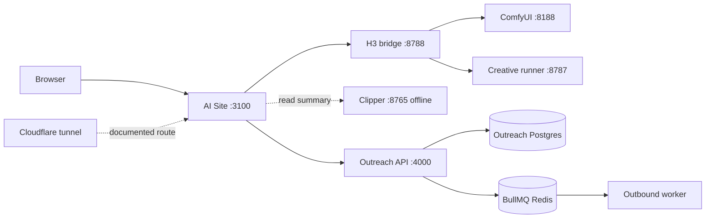

# Current runtime map

Snapshot: 2026-09-29, read-only host/process checks. A listening port proves a process is present, not complete business functionality.

| Component | Observed process/start | Bind/port | State and owner |
| --- | --- | --- | --- |
| AI Site | `node ...\app\node_modules\next\dist\bin\next start -p 3100 -H 127.0.0.1`; `app/start-platform.ps1` is manual startup helper | 127.0.0.1:3100 | Listening; AI Site owns UI, audit JSONL, operation journals |
| H3 bridge | `node --env-file-if-exists=.env.local ...\h3-bridge\dist\server.js`; same startup helper | 127.0.0.1:8788 | Health 200; validation ready, generation available; bridge owns jobs/artifacts |
| Creative Studio runner | bundled `runtime/runner/runner.cjs` | 127.0.0.1:8787 | Listening; Creative Studio owns sessions/archive |
| ComfyUI | Comfy Desktop Python processes, shared input/output configured by Desktop | 127.0.0.1:8188 and 8189 | Both listening; bridge targets 8188 by example config; GPU is shared |
| LM Studio | local model server | 127.0.0.1:1234 | Listening; Clipper/Creative Studio model calls use local OpenAI-compatible API |
| Clipper | FastAPI + Vite/Electron when launched by operator | expected 127.0.0.1:8765 and :5173 | Neither listened; safe health request timed out; native source/storage present |
| Outreach web/API | Docker `tiktokoutreach-web-1`, `-api-1` | 127.0.0.1:3000, :4000 | Docker reports healthy; API owns campaign state |
| Outreach Postgres/Redis | Docker `tiktokoutreach-postgres-1`, `-redis-1` | 127.0.0.1:5432, :6379 | Docker reports healthy; existing Outreach only |
| Outreach workers | Docker discovery, history, outbound-live containers | no public listener | Containers up; outbound worker owns actual sends |
| n8n | Docker `n8n-local` | 127.0.0.1:5678 | `/healthz` 200; Docker volume `n8n_data`; no required first-release dependency found |
| Cloudflare | Windows service `Cloudflared`, automatic | outbound tunnel | Running; existing docs state route to 3100; current route config not revalidated |

`app/.env.local` selected nonsecret flags: `AUTH_ENABLED=false`, `OUTREACH_QUEUE_ENABLED=true`. Bridge flag: `BRIDGE_REAL_SUBMISSION_ENABLED=1`. These are observations, not change recommendations for this internal runtime. Do not put their secret-bearing environment files into documentation.

## Storage and databases

- AI Site: `app/data/audit/YYYY-MM-DD.jsonl`, `app/data/outreach-operations/`, and `app/data/auth-sessions/`; file-based internal state, no SaaS database.
- Bridge: `h3-bridge/data/jobs/<uuid>/` metadata/events, references, output MP4; `data/generation.lock`. The bridge history GET reported three completed jobs at audit time.
- Creative Studio: own SQLite/session state and archive under `D:\AI Videos`; `C:\Data\proya-creative-studio\data` holds native product/master data. No AI Site ownership.
- Comfy Desktop: `C:\Users\lbbch\AppData\Local\Comfy-Desktop\ComfyUI-Shared\input` and `output`; GPU/model state stays native.
- Clipper: `D:\VOD` watched input, `D:\output_clips` results, repository `working/` for queue, transcripts, SQLite and recovery files. See [Clipper audit](clipper-audit.md).
- Outreach: production Postgres 17 and Redis 7 Docker containers started from `C:\Data\TikTok Outreach\docker-compose.yml`. The Postgres volume is `tiktokoutreach_postgres_data` (`/var/lib/docker/volumes/tiktokoutreach_postgres_data/_data` inside Docker); these are native Outreach state, not the SaaS source of truth.
- n8n: Docker volume `n8n_data` (`/var/lib/docker/volumes/n8n_data/_data` inside Docker); currently an external automation service, with no verified SaaS contract.

## Boundary diagram

**Startup/deployment:** AI Site and bridge are local Node processes; Creative/Comfy/Clipper are native Windows applications; Outreach and n8n run in Docker; Cloudflared is a Windows service. No current component is a customer SaaS control plane. AI Site's `start-platform.ps1` starts only its own site/bridge and does not own the native systems.
