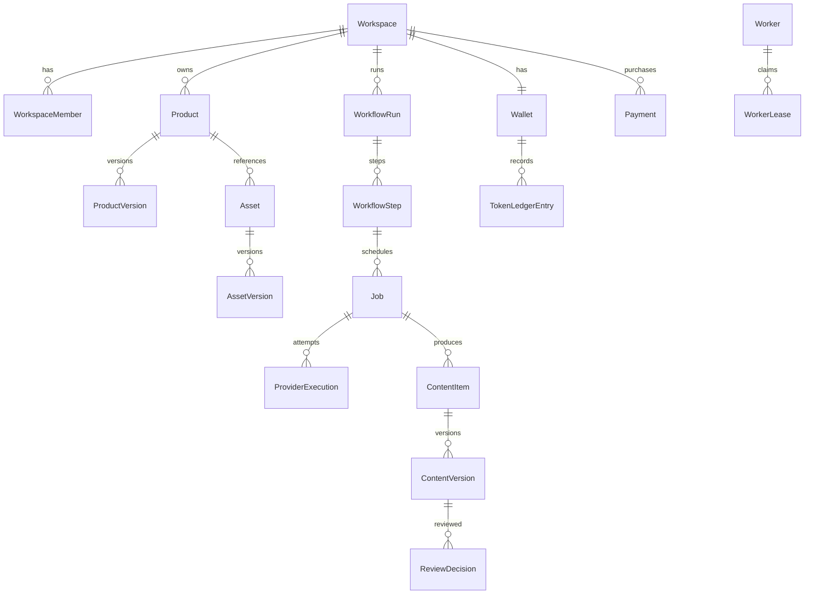

# Proposed SaaS Postgres model (no migration performed)

Every customer-owned table has `workspace_id` directly or a constrained path to it; prefer direct column for authorization, indexes and composite FKs. All tables have UUID/ULID stable ID, `created_at`, `updated_at` where mutable, and appropriate unique constraints. Immutable versions and ledger entries never update in place. `deleted_at` means archive/soft delete where historical lineage or billing requires retention.

| Group | Tables and essential fields/constraints |
| --- | --- |
| Identity | `users(id, auth_subject unique, email, status)`; `workspaces(id, slug unique, owner_user_id)`; `workspace_members(workspace_id,user_id,role,status, invited_by, joined_at)` unique pair; role enum Owner/Admin/Editor/Viewer; invitation/recovery flows in auth service |
| Product | `products(id,workspace_id,sku,status,current_version_id)` unique active `(workspace_id,sku)`; `product_versions(id,product_id,workspace_id,version,brand,name,category,description,benefits,audience,snapshot_json)` unique `(product_id,version)`; `product_accuracy_rules(id,product_id,workspace_id,current_version_id)` and immutable `product_rule_versions(...,version,rules_json)` |
| Media | `assets(id,workspace_id,product_id nullable,kind,purpose,current_version_id,archive_state)`; immutable `asset_versions(id,asset_id,workspace_id,version,object_key unique,sha256,bytes,mime,width,height,duration,source,rights_json,permission_json,verified_at)`; explicit `asset_purpose` lookup if extensible taxonomy needed |
| Workflow | `workflow_definitions(id,workspace_id,template_key,template_version,draft_json,status)`; `workflow_runs(id,workspace_id,definition_id,product_version_id,rule_version_id,input_snapshot,max_tokens,status,paused_at)`; `workflow_steps(id,workspace_id,run_id,step_key,parent_step_id,ordinal,state)` with unique run/step key |
| Jobs | `jobs(id,workspace_id,product_id,workflow_run_id,step_id,type,idempotency_key,status,input_snapshot,provider,provider_job_id,worker_id,progress,output_asset_id,error_code,error_detail_safe,attempt_count,reserved_tokens,charged_tokens,price_version_id,created_at,queued_at,started_at,finished_at)`; unique `(workspace_id,type,idempotency_key)`; `job_attempts`/`provider_executions(id,workspace_id,job_id,provider,external_id,request_key,state,started_at,finished_at,cost_internal)` unique provider/external ID; durable `job_outbox` unique event key |
| Content/review | `content_items(id,workspace_id,product_id,origin_job_id,current_version_id,state)`; immutable `content_versions(id,workspace_id,content_id,version,asset_version_id,product_version_id,rule_version_id,workflow_run_id,provider_execution_id,source_asset_version_id,review_state)`; `content_relations(workspace_id,parent_content_id,child_content_id,relation_type)` unique tuple; `review_decisions(id,workspace_id,content_version_id,reviewer_user_id,decision,issue_categories,reason,created_at)` |
| Tokens/prices | `wallets(id,workspace_id unique)`; append-only `token_ledger_entries(id,wallet_id,workspace_id,type,available_delta,reserved_delta,amount_signed,job_id,payment_id,price_version_id,actor,idempotency_key,occurred_at)` unique `(workspace_id,idempotency_key)`; `price_catalog(id,operation,tier,status)`; immutable `price_versions(id,catalog_id,version,unit_formula_json,currency,tokens,valid_from,valid_to)`; internal provider cost table separate/admin-only |
| Payments | `payments(id,workspace_id,provider,merchant_reference unique,provider_payment_id,status,amount_minor,currency,token_package_version,created_at,confirmed_at)`; `payment_events(id,payment_id,provider_event_id unique,payload_hash,status,received_at,processed_at)`; refund records/events as distinct rows |
| Worker/integration | `workers(id,kind,public_key_id,capabilities_json,version,state,last_heartbeat_at,max_concurrency)`; `worker_leases(id,worker_id,job_id,attempt,fencing_token,expires_at,state)` unique active job lease; `integrations(id,workspace_id,type,account_external_id,credential_ref,status,authorized_by)`; `outreach_campaigns` later only, workspace and integration scoped |
| Audit | append-only `audit_events(id,workspace_id nullable,actor_user_id,action,subject_type,subject_id,request_id,safe_metadata,occurred_at)`; no raw secrets, uploads or messages |

Key cross-table constraints: composite FK `(workspace_id, product_id)` etc where possible; one current immutable version pointer per product/asset/content; source asset and parent content in same workspace; payment/ledger/job same workspace; price version pinned at reservation; a run snapshots exact product version, rule version and asset version IDs. Product archives preserve historical snapshots. Purpose values cover front/back/left/right/packaging/cap-pump/texture/usage photo/usage video/product video/other. Rules cover logo/text/shape/cap/color/material/application/custom.

## Relationship sketch

Postgres is chosen because workspace/job/ledger/payment transactions and uniqueness need one authoritative transactional store. Native Outreach Postgres and Clipper SQLite remain independent; no data migration is implied.
