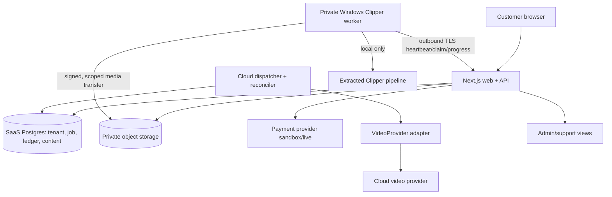

# Proposed paid SaaS architecture

**Recommended first-release shape:** one deployable Next.js web/API, one Postgres database as the **new SaaS** source of truth, private R2 via an S3-compatible storage port, a Postgres-backed transactional job outbox/claim loop, a small cloud dispatcher/reconciler process, cloud video provider adapters, and an outbound-only private Windows Clipper worker. Avoid Kubernetes and independent microservices until operations justify them. Existing internal systems continue separately.

Plain text: browser → authorized API → Postgres transaction (quote, reserve, job/outbox); dispatcher reads durable intent → provider or worker; provider/worker result → object storage validation → ContentItem/Review state → ledger capture; failure → reconciliation and release when definitive. Browser only observes and requests actions. The API grants short-lived upload/download capabilities after workspace authorization. A private worker calls the SaaS; no inbound connection to the processing PC.

## Customer and asset paths

- **Sign in/workspace:** account identity → membership/role on every request → workspace-scoped query. Product records and version snapshots live in Postgres; media bytes live in private objects.
- **Upload:** API creates pending AssetVersion and ID-derived object key → signed PUT for one object → client uploads → API verifies size, MIME by bytes, checksum, ownership, then marks ready. No customer filename becomes an object key. Download: API checks workspace and review/rights state, then streams or returns a short-lived signed GET.
- **Video:** quote from versioned PriceCatalog → atomic reservation/job/outbox → VideoProvider `submit` with provider idempotency key → callbacks/poll and progress → artifact ingest/checksum → content version/review → capture. Provider selection maps customer Fast/Quality/Premium from internal admin configuration. Adapter contract: `capabilities`, `quote`, `submit`, `poll`, optional `cancel`, `retrieve`, `normalizeProgress`, `mapError`. Store ProviderExecution per attempt and normalized output. H3 remains an internal adapter/test reference, not assumed cloud provider.
- **Clipper:** private worker registers version/capabilities/capacity, heartbeats and claims a fenced lease, downloads source through temporary authorization, transcribes/analyzes/renders locally, uploads clips, posts manifest and completion. The API validates lease and objects, publishes content, then captures reserved tokens. Lost worker triggers lease expiry and safe reconciliation before retry.
- **Workflow:** controlled templates, initially Product → Script → Video → Clip → Human Review → Library. Definition/version and product/price snapshots freeze at run start. A DB dispatcher schedules child jobs only when dependencies and max token budget allow. Pause stops *new* scheduling; existing jobs finish and settle. Rejection blocks downstream steps. No free-form graph engine for v1.
- **Content and review:** ContentItem/Version/Relation capture source, product/rule/assets versions, job, provider/worker, token charge and reviewer. Approvals require original references beside output. Only approved versions enter downloadable/eligible downstream state.
- **Admin:** narrow internal views of workspace, user, wallet/ledger, payment/event, job/execution, worker/lease, asset, workflow, errors and reconciliation. Provider costs/margins remain internal.

## Deployment choices

| Component | Small-team recommendation | Alternative / decision point |
| --- | --- | --- |
| Web/API | Managed Node host or one small VM/container with persistent URL and secret manager | Keep current local site only as internal test; deployment must support long-lived API callbacks and protected media auth |
| Postgres | Managed Postgres with backups/PITR | Self-hosted Postgres adds operational burden; do not reuse Outreach PG as source of truth |
| Objects | Cloudflare R2 private bucket, behind S3-compatible interface | AWS S3 or another S3-compatible host if region, contract, or compliance requires it. R2 documents signed PUT/GET and S3 API [here](https://developers.cloudflare.com/r2/api/s3/presigned-urls/). |
| Queue/orchestration | Postgres job/outbox with `FOR UPDATE SKIP LOCKED`, leases, periodic reconciler | Add Redis/BullMQ only when throughput proves Postgres insufficient; Redis must never be sole intent record |
| Video | Cloud provider adapter with controlled tier mapping | First provider candidate: official Seedance 2.x/2.5 **after** account/API-region, reference fidelity, rights, callback and cost bake-off. Official [model pricing](https://docs.volcengine.com/docs/ark/model-pricing?lang=zh) is dynamic. Sora API is an alternative with documented async video jobs [here](https://platform.openai.com/docs/api-reference/videos); no single provider is hardcoded. |
| Worker | Private Windows agent on processing PC, outbound HTTPS only | Scale to more workers by capability/capacity after one-worker correctness |
| Admin | Protected routes in same app with separate admin authorization | Separate service only if access/scale demands it |

This plan distinguishes a cloud control plane (identity, authorization, Postgres, billing, dispatcher, storage signing, provider adapters, admin) from private compute workers (Clipper, optional future local models). Current Cloudflare tunnel and local 3100 deployment are not customer SaaS deployment decisions.
