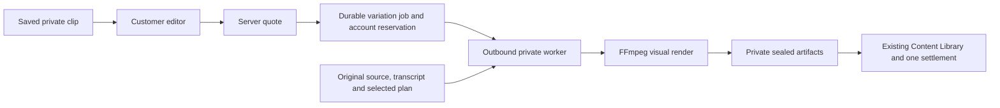

# Phase D — Clipper Editing & Variations

## Outcome

**PASS — Phase D Clipper Editing & Variations, with the documented native deferrals and internal-beta price.** The additive migration is applied, the production build and all acceptance gates pass, and the updated SaaS is running. Existing customer history, shared wallet balances, previous Phase A/B/C evidence and the native application remain preserved. Outreach and Phase 10 are not started.

Baseline: Phase A/B/C PASS; Phase C implementation `7d5b30029baa1b40cab7e230edac5e32b1c94e89`, documentation `23563ceec6541de5004a22075089b6d2a35adb87`. The initial [native audit](phase-d-native-clipper-audit.md) was written before application changes and is retained.

Implementation commit: `e19b173bd2eb3ab29630dde22c862c4227385877` (`Implement Clipper editing and variations`). Documentation and sanitized acceptance evidence are committed separately; neither commit is pushed automatically.

## Native Clipper Audit Summary

The read-only reference was `C:\Data\Clipper Ai Trends`. Its Variants page configures revisioned profiles for **future clips**, with 1–6 variants. Finished clip review offers previews and scored sibling results. It is not a timeline editor. UI tabs, profile schema, expansion/rendering, export, preview cache, assets and base-artifact reuse were inspected. Native source/document hashes and existing unrelated native changes were preserved; no native app, database, config or process was changed.

## Native → SaaS Parity Matrix

| Feature | Native | SaaS Phase D | Status / difference |
| --- | --- | --- | --- |
| Variant name | Named profile entry | Optional bounded name, stable Variation number | PORT |
| Count/navigation | 1–6 independently configured profile entries | Individually quoted durable renders, numbered family history | ADAPT; no batch render charge hidden behind a count control |
| None/text hook | Existing moment hook or no hook | Same frozen hook toggle | PORT; no new headline generation |
| Image/B-roll/combined/transition hook | Native creative library and Product media | Not offered | DEFER; requires immutable private creative assets and timeline design |
| Host footage/audio-over-B-roll | Host or replacement visuals with preserved voice | Original clean source footage/audio | DEFER replacement footage; no private B-roll mapping contract |
| Six text styles | Current, Creator Bold Pop, Native Clean, Premium Skincare, Sales Karaoke, Urgency Stack | Same choices, adapted font/size/color/highlight/phrase defaults | ADAPT; static typography and timed highlighting, not exact native motion parity |
| Color grade | Original, Warm, Cool, Vivid, Desaturated, Cinematic | Same named allowlisted filters | PORT |
| Flip | Horizontal mirror | Horizontal mirror | PORT |
| Subtitle toggle | Captions on/off with retained transcript | Captions on/off, original transcript retained | PORT |
| Subtitle placement | Top/center/bottom plus exact Y 8–92% | Same choices and range | PORT |
| Subtitle size | Compact/small/medium/large | Same relative scaling at 720×1280 | ADAPT; native 1080-based pixel sizes scaled by 2/3 |
| Word highlight/phrase captions | Timed active word and preset phrase treatment | Frozen word intervals when present, static phrases otherwise | PORT/ADAPT; no estimated word timing |
| Subtitle/headline/Product fonts | Discovered local files, independent roles | Curated Clean sans, Bold display, Classic serif for subtitle/hook | ADAPT; Arial/Impact/Georgia worker font selection; Product-caption fonts deferred with overlays |
| Base/highlight colors | Hex colors | Validated six-digit hex colors | PORT |
| Caption/headline motion, outline, shadow | Native preset motion/rotation and styling | Safe static outline/shadow plus typography | ADAPT/DEFER exact motion; prevents claiming full animated preset parity |
| Relevant B-roll | Indexed Product-role assets | Not offered | DEFER; no SaaS asset catalog with frozen selection evidence |
| Product zoom/intensity | Detector events, product/face tracking | Not offered | DEFER; no durable tracking/detection inputs |
| Background music | Auto/none/selected local track, looping/ducking | Retains source audio | DEFER; private licensed audio catalog required |
| Sound effects | Local controlled assets/event plan | Not offered | DEFER with private audio assets |
| Dynamic text intensity/roles | Ingredients, benefits, usage, CTA from approved indexed facts | Not offered | DEFER; requires approved-fact/compliance snapshots |
| Dynamic role font/size/motion/duration | Role-specific settings, 1–6 second duration | Not offered | DEFER with dynamic roles; no fabricated Product claims |
| Black bars | Independent top/bottom 0–40% | Same independent bounds | PORT |
| Top-bar hook | Frozen hook, font/color, 24–160px, X/Y 0–100% | Same controls with resolution scaling and safe ASS text | PORT/ADAPT |
| Save/load local presets | JSON recipes, revision conflicts, explicit apply | Built-in styles and inherited parent settings; browser draft/replay identity | ADAPT; customer-managed reusable preset library deferred |
| Visual preview | Six-second silent fixed sample, synchronous local FFmpeg | Private saved-clip playback and clearly labeled style guide; final private render preview | ADAPT; no silent sample presented as the customer's rendered result |
| Flags, diagnostics, rescan | Filesystem paths, indexed readiness, operator actions | Omitted | NOT CUSTOMER-SAFE |
| Finished review/export | Native score tiers, sibling media, batch/affiliate/WhatsApp export | Preview/download, original/variation family, existing Content review/archive | ADAPT media/history; native score-tier and affiliate/WhatsApp exports NOT RELEVANT |
| Resume/source reuse/output naming | Checkpoint fingerprints and local variant manifests | Server identities, frozen settings, leases, scoped keys, retained originals | ADAPT; no filename-based lineage |
| Manual timing/crop/speed/aspect/volume/caption text | No corresponding control in current Variants UI; legacy automatic diversity exists in backend | Not invented | NOT RELEVANT to exposed native parity |
| AI-assisted moment selection | Original transcription/analysis; visual profiles reuse selected moments | Reuses original transcript, selected timing and plan; zero new inference | ADAPT stored analysis; semantic reselection is outside Phase D |

## Final Editing UX

Finished clips have private Preview, Download and **Edit / Create variation**. The same action is available in Content Library. The editor configures one saved clip, shows private playback and a placement/color style guide, and quotes the render before submission. It contains no JSON panel, FFmpeg expressions, native paths, lease details, provider/model controls or artifact UUID labels.

Controls: optional name; six adapted text styles; existing text/no hook; six grades; flip; subtitles on/off, placement/exact Y, size, curated font, base/highlight colors, active-word highlighting and phrase captions; black bars with independent height; automatic top-bar hook, font/color/size and X/Y. Unsupported controls and arbitrary paths/filter expressions are rejected server-side before reservation. Disabling the top bar or text hook clears its dependent hook toggle.

The editing surface honors system light/dark preferences without introducing a new global theme setting. Screenshot review found and corrected a dark quote-card contrast issue; browser tests now require readable Token quote contrast. A successful draft links back to its saved render, and an explicit “Start another variation” action obtains a fresh submission identity and quote.

## Variation Architecture

Requests return after atomic admission. Rendering does not run inside the HTTP request or browser. `CLIPPER_VARIATION` is a separate operation/job identity from original `CLIPPER`. Existing generation/transcription/analysis remains intact.

## Data / Lineage Model

Forward migration `0014_clipper_variations.sql` adds a workspace-scoped immutable variation manifest. It stores source Content/version/artifact, root Content/version/artifact/job, optional parent variation, monotonic variation number, canonical frozen settings/hash, actor/time, render job and resulting Content/version/artifact. Workspace composite foreign keys and identity triggers enforce the relationships. Job and lineage creation commit atomically; lineage cannot be deleted or rewritten.

Each result is a new existing-model `CLIP` Content item with version 1 and `VARIANT_OF`/`CLIPPED_FROM` relations. **Variation numbers are not Content version numbers.** The original item/version/artifact/plan stays unchanged. Editing an existing variation inherits its settings but renders from the clean original source, so burned-in captions and transformations are not compounded. Root and immediate parent remain explicit.

There is no competing media store. Original transcript/plan references are frozen in job lineage. A byte-identical sealed transcript copy and a variation-specific settings/plan artifact belong to the new job, preserving the existing Content foreign-key and retention contract. No transcript text is mutated. No fake variation backfill is applied to legacy results; clips without reusable durable inputs fail safely.

Bounds include one selected moment of at most 90 seconds, name ≤80 characters, caption Y 8–92%, bars 0–40%, hook size integer 24–160, hook X/Y 0–100%, allowlisted enums/fonts/colors, 10,000 numbered renders per root version and the existing Content ancestry bound. The family view shows at most 100 records; the existing Content/Job history remains the full ecosystem for saved outputs.

## Worker Execution

`VariationPipeline` retrieves and verifies the original private source and sealed transcript/plan, validates the frozen selection, builds allowlisted filters and ASS captions, renders one 720×1280 H.264/AAC clip, probes it, uploads/finalizes artifacts and completes the leased job. It does not invoke the transcriber or analyzer. Progress comes from actual preparing, rendering, saving and finalizing steps.

Registered `CLIPPER_VARIATION_V1` workers can claim these jobs. An upgraded registered `CLIPPER_V1` worker can also claim them after reporting `variationRenderAvailable: true`; old workers without the flag cannot claim. Variations require FFmpeg and sufficient disk, and do not require GPU/transcriber/analyzer readiness. Separate per-job/per-attempt work directories and immutable artifact allocations prevent collisions.

The ordinary live worker was offline at inspection and was left operator-managed. The dispatcher is also currently stopped; no persistent dispatcher was started by acceptance. Start the updated agent and the existing dispatcher normally when enabling live queued rendering, publication and settlement. No worker credentials were rotated and no native/other worker process was stopped.

## Billing / Quote Model

Price version 1 is **100 Tokens per visual render, INTERNAL BETA, not final commercial pricing**, for at most 90 seconds and policy `clipper-visual-variation-v1`. Separate immutable TEST/PRODUCTION catalogs label this explicitly. This value does not price transcription or model analysis and is not a commercial pricing approval. Future values use the existing allowlisted operator-only catalog CLI, a new immutable version and positive `perRender`, bounded `maxDurationSeconds`, exact policy and `approval: INTERNAL_BETA`.

Phase C's account wallet remains authoritative. Quotes bind account, workspace, actor, price version and exact frozen input; admission locks the shared wallet, checks limits and reserves before execution. One job has one RESERVE and one CAPTURE on success, or one RELEASE on definite failure/cancel. Retry uses the existing reservation. The original Clipper ledger is not touched. Underfunded simultaneous 100/100 requests against 100 available admit one and deny the other with 402; balances stay nonnegative.

## Start-Time UI

Original and variation Clipper progress/history show human-readable **Started** and **Completed**, using the existing Clipper UI timezone convention. Queued work says it is waiting to start; retries retain the first start time. Variation links from generic Jobs restore the Clipper status page.

## Content Library Integration

New results use existing private previews, downloads, review, archive, publication and poster infrastructure. Family history identifies Original and Variation N, including immediate parent and failure/cancel/archive status. Archiving a variation hides it according to existing Content semantics while retaining its versions, artifacts, parent and children. Historical parent deletion is forbidden. Private URLs expire and refresh; no public bucket or permanent media URL is added.

## Idempotency

Canonical request identity freezes source version and normalized settings. Replaying a matching key returns the original job before quote revalidation; conflicting input is rejected. The browser keeps the draft and submission identity in session storage, scoped to workspace/Content/version, without credentials or signed URLs. A committed admission followed by an intentionally aborted browser response, reload and resubmission was tested: one job, render, reservation, capture and publication. Known submitted drafts link to status; deliberate new intent gets a fresh key/quote.

## Crash Recovery

Actual private worker processes were terminated before render, with a live paced FFmpeg child, after render before upload, and after the real clip PUT before finalize. Recovery produced LOST → SUCCEEDED, fenced old progress/completion with 409, and published one result under the original reservation. Original bytes remained unchanged. Transcript/analysis counters stayed zero on every attempt. Sealed renders can be restored; work interrupted before a sealed checkpoint may rerender without a second reservation. Three lost attempts terminally fail and release once.

## Workspace Isolation

Brand B in the same Billing Account could not quote/create/access Brand A source Content, Content media, raw clip artifact download, variation ID, variation job or generic job. The controls first verify legitimate access returns 200, then require foreign direct IDs to return 404. Shared account funding grants no Content access. Parent/result workspace bindings also hold at the database layer.

## Shared Wallet Result

Controlled fixture: 1,600 account Tokens → original Clipper 600 → 1,000 available → visual variation 100 → **900 available, zero reserved**, immediately identical in both brands. No original Clipper charge repeats. Separate-account isolation, concurrent spend, fake verified payments/refunds and onboarding are covered by the unchanged Phase C contract tests.

## Responsive / Browser Result

Actual installed Chrome and Edge were used at 1440×1000, 768×1024 and 390×844 in light and dark modes. The final matrix, screenshots, console/network/secret checks and Token quote contrast measurements are in [Phase D evidence](phase-d-evidence/). Both browsers submit/render, play the private result, show timing, and navigate the Content family in isolated QA. All 12 browser/viewport/theme cells pass without page errors, private-response/console secret findings or horizontal overflow.

After production restart, both installed browsers also passed public HTTPS login/register/recovery page and health smoke checks at `https://ai-test.proyaofficial.com`; no local-mailbox wording, synthetic token reflection or browser errors were found. This remote smoke is public-page coverage; the authenticated rendering matrix uses isolated QA accounts and private storage, not historical customer media.

## Phase A/B/C Regression

Existing integration and full browser tests passed, together with Phase B signup/verification/recovery queue behavior, workspace switching, Product uploads/replacements/cover/frozen history, active AI Video restore and quote UX; Phase C account wallet/payment/refund/concurrency/isolation tests and Phase A navigation/media/security checks. All seven original Clipper process-loss/retry-bound cases pass with real FFmpeg, preserving the original pipeline. Real remote SMTP evidence from Phase B is preserved; regression uses isolated local QA mail and does not re-send real operator emails or change SMTP credentials.

## Tests

All final runs pass with **300 successful test executions and 264 distinct cases by test title**. The integration suite's 35 cases also run under the full browser command, and one focused contract repeats in another regression suite; 300 is not a claim of 300 unique cases. There are zero final failures or skips.

| Command / isolated suite | Passed | Failed / skipped |
| --- | ---: | ---: |
| `npm run test:unit` | 91 | 0 / 0 |
| Worker: `python -m unittest discover -s tests -v` | 82 | 0 / 0 |
| `npm run test:integration` under the Phase D harness | 35 | 0 / 0 |
| `npm run test:browser` under the Phase D harness | 41 | 0 / 0 |
| Dedicated D variations | 7 | 0 / 0 |
| Dedicated D actual worker interruptions / retry bound | 5 | 0 / 0 |
| Dedicated D editor (two cases, 12 browser/viewport/theme cells) | 2 | 0 / 0 |
| Dedicated D lost-response / direct-ID / worker-gate supplemental checks | 3 | 0 / 0 |
| Phase A focused regression | 6 | 0 / 0 |
| Phase A original Clipper restart / retry regression | 7 | 0 / 0 |
| Phase B customer/auth/Product regression | 8 | 0 / 0 |
| Phase C shared-account wallet regression | 13 | 0 / 0 |

`npm run lint`, `npm run typecheck` and `npm run build` all exit 0. The tested canonical schema, transactional live migration, final history preservation, secret audit and remote public HTTPS gates all pass. Sanitized [counts and cleanup](phase-d-evidence/tests.json), per-suite `*-run.json`, scenario JSON and screenshots are retained here.

Reproduce the isolated suites with `node tests/phase-d/run.mjs --suite <suite>` for `integration`, `browser`, `variations`, `restart-variation`, `editor`, `isolation`, `focused`, `restart`, `phase-b` and `shared`. Run them sequentially or assign distinct `--app-port`/`--storage-port` values. The harness invokes the required existing npm commands in isolated environments. `node tests/phase-d/preservation.mjs --verify` and `node tests/phase-d/audit.mjs` verify preserved history and secret boundaries without migrations or paid operations.

Test databases, private buckets and gateways are uniquely named `phase_d_*`/`phase-d-*`; providers are fake, and all owned resources and local QA mail are removed. Final read-only inventory found **zero remaining Phase D databases, buckets or gateways**. Real worker transfers/probes/FFmpeg are retained. The test-only fault adapters are opt-in and reject live origin/DB/provider configuration. Runtime and report audits persist categories/counts, never matched secret values. Production browser bundles, SaaS/QA/worker logs, customer browser responses, tracked/untracked source and staged Git content are scanned; private configuration stays ignored and byte-identical. No test runner or test gateway is intentionally left running.

## Paid Operations

Real AI Video inference: **0**. Real WaveSpeed LLM analysis: **0**. Outreach sends: **0**. Real payment charges: **0**. Temporary TEST Token reservations/settlements and real local FFmpeg work are not external inference or fiat charges.

## Data Mutation Summary

The migration is additive: new empty variation table/constraints/functions and two internal-beta price catalogs with two immutable price versions. Existing migrations are unchanged; no Jobs, artifacts, Content versions, Product/source history, shared account identities or ledger rows are backfilled/rewritten. Transactional before/after fingerprints match for all **21 customer/history tables**, including 20 Jobs, 30 artifacts, 13 Content items/versions and 35 ledger entries. The live wallet remains **5,080 available / 0 reserved**. All **274** prior documentation/evidence files and **320** native reference files match their original hashes, as do private SaaS/worker configuration files. The live variation table remains empty; no fake legacy lineage was added. QA mutation was restricted to owned isolated databases/buckets and has been removed. [Migration](phase-d-evidence/live-migration.json), [preservation](phase-d-evidence/preservation.json) and [secret audit](phase-d-evidence/secret-audit.json) record these gates.

## Deferred Native Features

Private creative/music/SFX libraries; B-roll/transitions and audio-over-B-roll; detector-based Product zoom; approved-fact dynamic Product roles and their fonts/motion/duration; exact native animated presets; reusable customer-managed profile storage. These need asset, licensing, fact, tracking or product contracts. Native global filesystem diagnostics/rescan are unsafe for customer UI. Legacy automatic diversity and affiliate/WhatsApp export are not exposed editing parity requirements. No manual timing/crop/aspect/volume/caption-text editor was invented.

Remaining limits: fixed source moment and 9:16 output; final preview requires a quoted render; active-word highlight requires saved word timing (otherwise static phrases); curated fonts and static preset adaptations; retained originals require available private source/transcript/plan; shared wallet funding does not share media; updated worker and existing dispatcher must be running for live processing; beta price awaits commercial approval.

## Remaining Product Phases

**OUTREACH SAAS → next separate phase.**

**PHASE 10 → not started.**

Neither phase was started by this work. No automatic push is performed.
