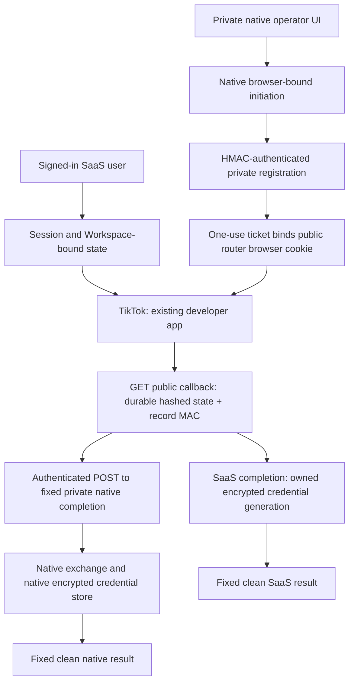

# Phase F.1 — Shared TikTok OAuth Callback Router

## Outcome

**Implementation, fixture acceptance and deployment: PASS. Provider cutover/live certification: PENDING operator review. Secret audit: FAIL for the unresolved legacy credential incident; new material: PASS.**

The SaaS and native API/UI are deployed and healthy, checked on 2026-10-08. Partner Center remains unchanged. Real SaaS activation remains closed by the existing contract-review and internal-account exclusion guards. This phase creates no live seller authorizations and enables no real sending.

SaaS implementation: `eb5b4264454b884815a387dcf197244ee2c0d8cf`. Native implementation: `893c62e8bd8013d1bd656f232c86e8fb4caf5ce8`. The documentation commit containing this report is identified in the final task response.

Deployment applies one new migration in each database, after verifying all 17 existing SaaS and 36 native migrations. Local and remote SaaS health, native `/health`, and native UI health return 200. The deployed router source matches the implementation commits; the native version environment label remains its existing `local` value. Forged native completion returns 403. Runtime configuration confirms the shared app, matching handoff key, independent router key, closed activation guards and disabled real sending.

The native build uses an isolated committed-source export with the already deployed Creator Database UI retained. Unrelated pending API changes are excluded, and all original native working changes remain intact. Registry timeouts prevented the initial package-install build. The successful build reuses existing local dependency images after matching their lockfiles, and disables dependency reinstallation in those API/UI images. pnpm's [dependency verification behavior](https://github.com/pnpm/pnpm/issues/14551) can otherwise trigger an install before a script. No dependency upgrade or worker restart was performed.

Preservation checks retain all 1,425 original unaffected repository files, including 779 original documentation/evidence files and 663 prior phase evidence files, plus 245 unaffected native tracked files. All 84 SaaS and 41 native original table schemas remain intact, with no table row-count decreases. SaaS customer, wallet, ledger, job and content fingerprints are unchanged; only worker/service heartbeats changed. Native campaign/delivery history, credential material in all 801 existing grants, and shop selection are unchanged. The pre-existing native Creator Database sync remains RUNNING and accounts for read/sync metadata growth; its worker was not restarted. All 13 protected infrastructure/worker containers retain their original IDs. Fixture databases, buckets, gateways and processes were removed; no fixture port remains listening.

## Final Router Architecture

The intended provider callback is `https://ai-test.proyaofficial.com/api/outreach/tiktok/callback`. The provider receives only random state. Flow selection comes from the server record; browser routing selectors and arbitrary return destinations are rejected. The native API remains loopback-published. No new Cloudflare route exposes it.

## OAuth State Model

New forward migrations add SaaS `outreach_oauth_router_states` / `outreach_oauth_handoff_nonces`, native browser/operation binding columns, and native `TikTokOAuthHandoffNonce`. Old migrations are unchanged.

State is 32 random bytes encoded as 43 base64url characters, stored as SHA-256, with a maximum ten-minute lifetime. Each row has a unique operation ID and exactly one constrained flow kind. SaaS rows reference the original ownership state; native rows contain only the authenticated initiation issuer, browser-binding hash, fixed completion identity and ticket hash. No authorization code or seller token is persisted in router state.

A dedicated independent HMAC key protects routing, operation, ownership, creation/expiry, browser binding and consumption fields. Browser binding happens once. Consumption locks the row, validates its MAC and bindings, and atomically changes its consumption timestamp and MAC. Unknown, expired, consumed, tampered, conflicting and superseded operations fail closed. A changed integrity key invalidates pending operations; connected seller credentials are unaffected.

## SaaS Session Binding

Initiation preserves the existing channel-management permission check. A first-workspace session with no explicit selection is bound to its already validated Workspace. The router records the user, session, Workspace, channel and operation. Callback verifies the current session, active user, current Workspace and membership, original pending channel/state, expiry and one-use status. It checks the session again before storing an encrypted generation after exchange. Callback query IDs cannot establish ownership.

## Native Session/Browser Binding

Native has no customer authentication layer. The minimum OAuth-specific boundary is the private operator UI at `http://127.0.0.1:3000`, strict Origin validation and an independent HttpOnly, SameSite=Lax, ten-minute native browser cookie. Missing/untrusted origins and old unbound states are rejected. Other UI origins require explicit private configuration review.

The existing Electron shell intentionally blocks external navigation; its development UI also uses port 3010. In that shell, Authorize seller now instructs the operator to open `http://127.0.0.1:3000/settings` in Chrome or Edge before starting authorization. It creates no OAuth state or binding cookie in Electron. Initiation, provider navigation and completion then stay in the same standard browser. The desktop binary, IPC permissions and navigation restrictions remain unchanged. Browser fixtures verify the desktop instruction creates no authorization request.

Native registers only state/operation/browser/ticket hashes through the authenticated server channel. Its UI submits the one-use initiation ticket in a POST body to the fixed public start endpoint. The public endpoint verifies the trusted native registration, exact configured operator origin and ticket, then binds an HttpOnly router cookie. That cookie is Secure on the HTTPS deployment, SameSite=Lax and scoped to the OAuth API. The callback requires the same browser binding. Neither browser chooses a shop or account as routing proof.

The original loopback callback remains available and now requires the initiating native cookie. It returns a fixed clean result. Existing unbound operations must expire before cutover; they cannot be grandfathered through the hardened flow.

## Private Native Handoff Security

Completion is a POST to a server-configured loopback origin and fixed `/api/v1/integrations/tiktok/private-completion` path. A separately generated shared handoff key signs a versioned context, POST method, exact path, canonical body hash, timestamp and random nonce. The receiver rejects missing/forged signatures, modifications, wrong paths/directions and clock skew beyond 60 seconds. Durable unique nonce hashes reject replay, including across process restarts. The OAuth handoff verifier rejects oversized bodies without lowering the existing body-size limit for other native API routes. A dedicated regression checks that bound.

Native additionally checks its own unconsumed state, operation ID, browser hash, router-registration status and expiry before exchanging the code. Only a completed native persistence returns 204. The public router never relays native response bodies. Failed/uncertain completion requires review in native settings and a new initiation; it is never automatically retried.

## Code/State Logging Protection

The first code change removes full request URLs and raw exception text/stacks from the native global unexpected-error logger. It logs only a server-generated correlation ID, allowlisted method, trusted Fastify route template and fixed category. Callback and private-completion handlers catch failures without recording provider input. Both Next applications disable framework development request/fetch/argument logging; application operational logging remains available.

Callback parsing is bounded and rejects duplicate or unrecognized routing/return parameters. Callback responses immediately redirect to fixed clean destinations, with no-store and no-referrer. Native result pages contain no external assets and use restrictive CSP. The SaaS application already applies no-referrer globally. No code is put in browser storage or returned in completion bodies.

Dynamic in-memory markers cover successful, unknown, expired, integrity-invalid, SaaS-provider-failed, native-provider-failed and unexpected-exception paths. Persisted reports contain only sanitized acceptance facts. Fixtures preserve the required temporary code/state navigation only in memory.

These bindings and referrer protections follow [OAuth security best current practice, RFC 9700](https://www.rfc-editor.org/rfc/rfc9700.html#section-4.7.1). Provider-specific contracts still require the operator review below; PKCE support is not assumed.

## Native / SaaS Credential Separation

The existing developer-app key, service ID and signing secret remain shared and unchanged. Router and handoff keys are newly generated independent keys; neither reuses mail, provider encryption or app secrets. No native seller token, refresh token, shop cipher, selection, sender identity or campaign record was copied into SaaS configuration.

SaaS exchange verifies provider shop ownership and stores Workspace/channel/generation-bound encrypted credentials in the SaaS database. Native exchange and encryption remain in native services/storage. Native completion never calls SaaS activation; SaaS completion never calls native `activeShop()` or writes native credentials. Isolated acceptance fingerprints the other store around each flow.

## Internal Account Exclusion Status

**BLOCKED — inventory ambiguity; private exclusion configuration remains unset.** Read-only inspection found one mapped native READ_ONLY shop and 652 encrypted TikTok grant records. Only one encrypted grant maps to an existing Shop; 651 have no matching Shop record. The guard requires canonical external shop identities, which cannot be inferred from unmapped native grant/seller IDs.

No raw identity is published, no partial list is provisioned, and no historical record is removed or guessed to be a fixture. Operator review must establish the provenance and external-shop mapping of these records, or authoritatively classify obsolete fixture grants under existing fixture policy. Once coverage is complete, derive exactly SHA-256 of UTF-8 `JSON.stringify({provider:'TIKTOK_SHOP',account:externalShopId})` into the ignored private exclusion list. Existing Phase F and F.1 fixtures prove a verified excluded shop is rejected without importing its credentials.

Sharing app credentials does not replace these exclusions. Provider grants for the same seller can affect native token lifecycle before a post-exchange SaaS exclusion check; use an independently controlled QA seller, never the internal sender, for later live certification.

## Contract Review Checklist

`OUTREACH_TIKTOK_CONTRACT_REVIEWED` remains unset/false. Before any operator enables it, verify and retain non-secret review evidence for:

- Existing app type/category and permission to serve this SaaS use case.
- Enabled markets, including the relevant seller market, and external/customer multi-seller authorization eligibility.
- Approved `seller.affiliate_messages.write` and `seller.creator_marketplace.read` scopes, plus the authorized-shop information grant and actual returned scope contract.
- The single Redirect URL and documented authorization input/callback fields, one-use code semantics and any supported additional security mechanism.
- Official token exchange/refresh endpoints, seller identity/type, absolute expiry fields, refresh rotation/revocation and grant interaction for the shared app.
- External shop ID versus seller open ID, shop cipher and Creator identity namespaces; never substitute one for another.
- Approved affiliate conversation/message endpoints and positive message-ID proof; ambiguous acceptance remains DELIVERY_UNKNOWN.
- Current App × Shop endpoint rate limits, daily quotas, Retry-After behavior and any shared app limits affecting native work.
- Native grant continuity, existing callback cutover, rollback and the requirement to use a different controlled QA seller.

Review the current [TikTok Partner Center authorization documentation](https://partner.tiktokshop.com/docv2/page/678e3a362dccb8030ea6f98c) and the app's actual permissions. Fixture success cannot establish provider commercial eligibility or grant approval.

## Callback Cutover Procedure

1. Confirm final implementation, regression, deployment, health and preservation evidence.
2. Resolve the complete internal-account exclusion inventory and finish the contract checklist before enabling SaaS customer authorization. Keep real sends at zero.
3. Pause new OAuth initiations in both applications; let old pending operations expire for ten minutes. Preserve connected seller credentials.
4. In the existing app's Partner Center **Redirect URL** field, manually replace the old loopback destination with `https://ai-test.proyaofficial.com/api/outreach/tiktok/callback`. There is one field; do not add a second app or change credentials.
5. Confirm the manual provider change and restore initiation flags as appropriate. Native uses the updated private UI/registration flow. SaaS remains fail-closed until its reviews are satisfied.
6. A subsequent authorized task may certify only authorization with an independently controlled QA seller. No real message or canary is authorized by this task.

Partner Center has not been changed here. No real seller authorization is started for cutover testing.

## Rollback Procedure

Pause new OAuth initiations using the separate SaaS/native initiation flags. Keep all connected grants, encryption keys, native shop selection, campaigns and workers intact. The operator can restore the old loopback Redirect URL. For direct native initiation during a public-router outage, disable only `TIKTOK_OAUTH_ROUTER_ENABLED`, restart only the native API as needed, and retain the hardened browser cookie/Origin checks. Re-enable new native initiations only after the old provider destination is restored.

Native outbound workers use already stored shop selection and encrypted seller credentials; they do not query OAuth router state or perform new authorization to send. They continue using their existing refresh/lifecycle logic. Rollback requires no token revocation, seller refresh, database restore or campaign change.

## Browser Result

Chrome and Edge pass at 1440×1000 and 390×844: SaaS connect, successful/failed callback, replay, desktop guidance before state creation, native browser UI initiation, private completion, failed native completion, clean result URLs and no callback-value console/response/referrer leaks. Clean result pages fit the viewports. Final runs serve all provider replies inside isolated fixtures.

Earlier browser attempts revealed a fixture redirect-interception mistake. Six attempted navigations used an invalid synthetic service ID at the provider authorization page; no real app credentials, seller grant, token exchange or message was involved. Playwright intercepts only the initial URL in a redirect chain. The corrected native fixture fetches the local start response with redirects disabled, preserves its browser-binding cookie and supplies the simulated callback locally. Final browser tests block unexpected external requests. Earlier failed attempt metadata is retained separately.

## Native Regression

221 native unit tests and 25 affected refresh/identity integration tests pass. The 205-test fixture run and separate 16-test provider-adapter run cover logging, callback shape, HMAC, operator-Origin validation, signing, seller token exchange/refresh parsing and encryption. Integration tests use an owned temporary database. Ten F.1 router tests also cover both stores, simultaneous consumption, cross-flow attempts, unknown/expired/tampered state, wrong session/Workspace/channel/browser, forged/expired/replayed private handoffs, marker protection and the legacy callback. Temporary native API/UI processes and databases were removed afterward.

## SaaS Regression

121 SaaS unit tests and 82 worker unit tests pass. All 16 independent Phase A–F regression groups pass: 178 acceptance tests, zero failures and zero skips. Coverage includes AUTH/SMTP, Workspaces, Products, AI Video, Clipper, variations/editor/restart/isolation, Content Library, shared wallet, Outreach TEST/lifecycle/DELIVERY_UNKNOWN, credential lifecycle and real-send gates. Mail regression uses isolated file delivery and preserves earlier real SMTP certification evidence. Canary controls are exercised only with isolated fixture providers; no real canary is started.

Together with native, router and browser checks, 641 tests pass. SaaS lint/type checking, native Web type checking, and both production builds pass. Counts and per-group results are in `phase-f1-evidence/test-summary.json` and `phase-f1-evidence/regression-summary.json`.

## Secret Audit

**New source/evidence/runtime/client material: PASS, zero detected private-value leaks. Overall secret audit: FAIL — legacy incident remains open.** The final audit covers new source/evidence, staged diffs, Git history additions, build/migration/runtime output and both client bundles. Dynamic callback markers do not appear in committed evidence or runtime output. Native client bundles contain zero detected private values. Credential values and complete verification/reset links are absent from the new committed material.

The previously exposed legacy DB credential remains active/unrotated. A baseline source inspection inadvertently displayed that same credential in conversation tool output; a categorical private check confirmed it still matches the active connection. Raw configuration output was stopped. This repeated exposure is an audit failure/open incident, not a clean secret-audit PASS. Its value is not repeated in this report, and this task does not rotate it or claim the exposure is repaired. Existing historical credential exposure in Git is also unresolved.

## Real Operations

Real seller authorizations: 0. Real token exchanges/refreshes initiated by this task: 0. Real Outreach messages/canaries: 0. Paid WaveSpeed/LLM/payment calls: 0. Real mail: 0. Partner Center changes: 0. `OUTREACH_REAL_SEND_ENABLED=0` remains unchanged in private live configuration. The earlier synthetic authorization-page navigation attempts are disclosed above.

## Remaining Manual Steps

Review the unmapped native-grant inventory, finish the provider contract review, and address the legacy credential incident in a separately authorized task. The implemented/deployed router is fixture-ready; this report does not declare every cutover prerequisite complete. Only the operator may perform the single-field callback cutover. After operator confirmation, a subsequent task may certify authorization with a different independently controlled QA seller. Do not authorize the existing internal seller as the SaaS QA account. Phase 10 and real sending remain outside this task.

Automatic approval review rejected removal of the temporary native source export with “blocked by policy.” The ignored local build folder remains in place. Fixture services, databases, buckets and gateways were successfully cleaned up; this retained build export is not committed or published.
